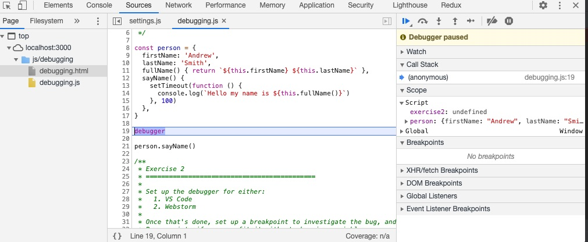
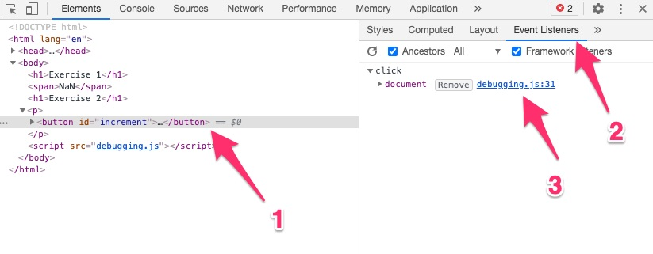
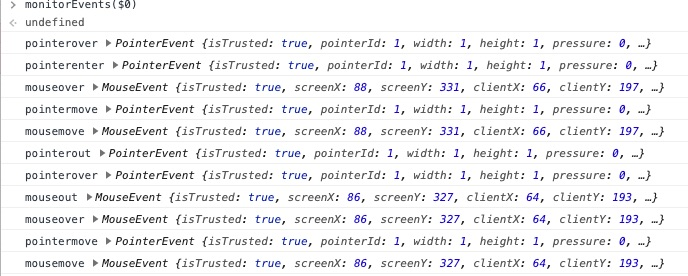
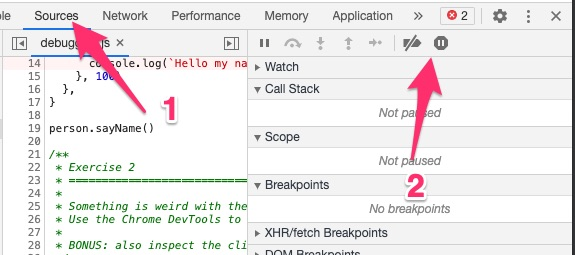
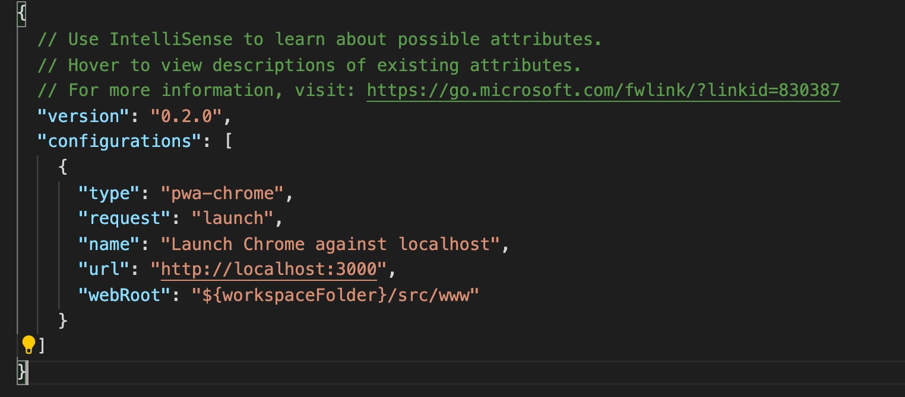
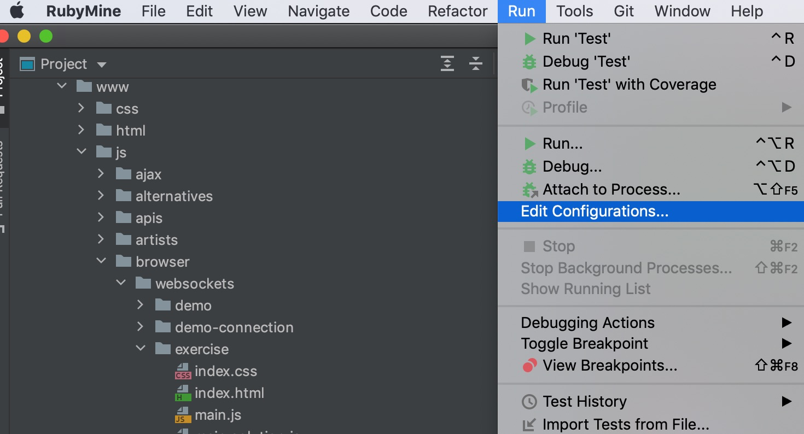
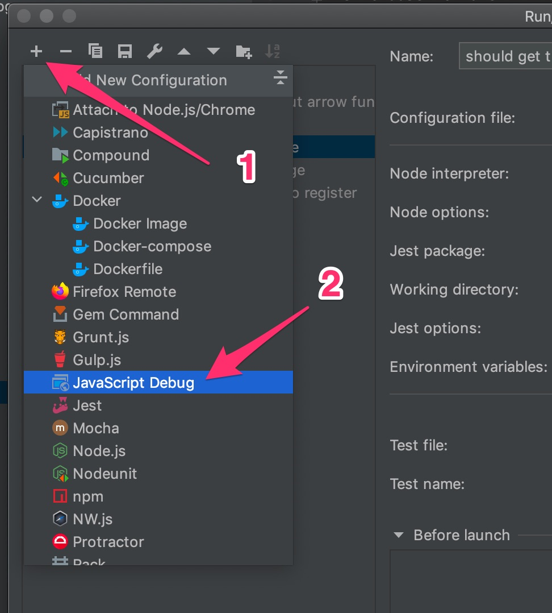
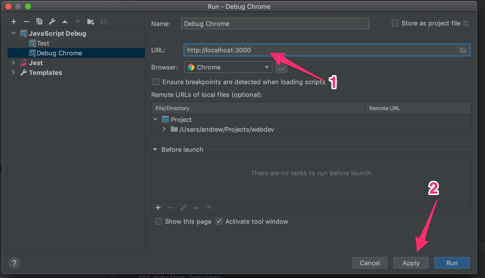

## Debugger

### DevTools

Drop a `debugger` statement to open breakpoint in DevTools

```javascript
const sayHello = () => {
  debugger
  console.log('Hello')
}
sayHello()
```

### DevTools



### DevTools

Finding an event handler:


### DevTools

You can look at the handlers on a specific element:



Or with `getEventListeners(element)`

### DevTools

See what events are happening for an element:

```javascript
monitorEvents(btnElement)
```



### DevTools

Pause on exceptions and hop into debugger:



This also works with failed `console.assert`ions!

### VS Code Debugger

Install Debugger for Chrome

1. Open command palette (Cmd+P / Ctrl+P)
1. Choose "Extensions: Install Extensions"
1. Search for "Debugger for Chrome" and install


### VS Code Debugger

Set up Chrome debugger configuration


Then choose "Chrome"

### VS Code Debugger

Two request options:

- **launch** - starts new Chrome instance
- **attach** - attaches to existing Chrome instance

We'll use **launch** because starting up Chrome with debugger is tedious.

### VS Code Debugger

- **url**: the URL to open in debugger
- **webRoot**: how to map URLs from browser to files on disk
  - e.g. be able to locate `http://localhost:3000/someFolder/foo.js`
  - in our case, served from `${workspaceFolder}/src/www`



### Demo

### Webstorm Debugger

Run > Edit Configurations



### Webstorm Debugger

Set up a new debug run configuration



### Webstorm Debugger

Provide the URL of your app



### Webstorm Debugger


### Resources

Google Chrome DevTools is constantly under development.

Keep an eye on their Web Updates ([link](https://developers.google.com/web/updates/2021)).

### Exercise

#. Go to http://localhost:3000/js/debugging/debugging.html

#. Open `src/www/js/debugging/debugging.js`
