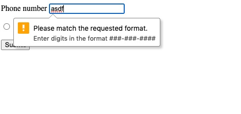

## Forms

### Forms

* Because what website can exist without one?
* Contains interactive controls for submitting information

```javascript
<form>
  {/* ... */}
</form>
```

* Common form elements
    * Examples?

### Form Inputs

```html
<form>
  Short text:
  <input type="text" name="name">

  Long text:
  <textarea rows="3" name="bio"></textarea>

  <input type="submit" value="Submit" />
  <button type="submit">Also a submit button</button>
</form>
```

### Form Inputs

Dropdown (select)

```javascript
<select name="pets">
  <option value="">Which one is better?</option>
  <option value="dog">Dog</option>
  <option value="cat">Cat</option>
</select>
```

### Form Inputs

Check boxes

```javascript
<input type="checkbox" name="newsletter" 
       value="1" id="subscribe">
<label for="subscribe">Sign up for newsletter</label>
```

### Form Inputs

Radio buttons

```javascript
<input type="radio" name="contact" value="email"
       id="contact-email">
<label for="contact-email">Email</label>

<input type="radio" name="contact" value="phone"
       id="contact-phone">
<label for="contact-phone">Phone</label>
```

### Form Inputs

Having checkboxes/radio buttons checked by default:

- set the `checked` property

```javascript
<input type="radio" name="contact" value="email"
       id="contact-email" checked>
<label for="contact-email">Email</label>

<input type="radio" name="contact" value="phone"
       id="contact-phone">
<label for="contact-phone">Phone</label>
```


### Submitting Forms

Inside a form:

```html
<form method="post" action="/users">
  <input type="submit" value="This will submit">
  <button type="submit">Also will submit</button>
  <button>Implicitly submit</button>
</form>
```

Will POST to `/users` with form data

### Submitting Forms


### Submitting Forms

Default is for page to show server response of POST


### Validations

Can add `required="required"` to most input elements

```html
<input type="text" required="required">

<select required="required">...</select>

<input type="radio" name="foo" value="foo" required="required">
```

### Validations

Can add `minlength="..."` or `maxlength="..."` to enforce length restrictions


### Validations

Add `pattern` to match against a RegExp pattern.

Include `title` to explain the pattern matching.

```html
<input type="text" pattern="[0-9]{3}-[0-9]{3}-[0-9]{4}" 
       title="Enter digits in the format ###-###-####">
```



### Exercise


### Submitting Forms AJAX

Instead you can catch 

### Forms in JS

* There are two ways to "do forms" in React
    * **Controlled**
    * **Uncontrolled**
* It describes how the state of the form is managed

### Uncontrolled Forms

* In vanilla JS, form elements do a great job of tracking their state 
* In **uncontrolled forms**, you *don't* need to provide things like a value or change handler

```javascript
<input type="text" />

// in js
document.querySelector('input').value // asdf 
```


### TODO Getting values


### Forms

Check boxes

```javascript
<input type="checkbox" name="newsletter" value="1">
<label>Sign up for newsletter</label>
```

```javascript
// js
$('input[name="newsletter"]').checked // true
```

### Forms

Radio buttons

```javascript
<input type="radio" name="contact" value="email">
<label>Email</label>

<input type="radio" name="contact" value="phone">
<label>Phone</label>

<input type="radio" name="contact" value="mail">
<label>Mail</label>
```

```javascript
document.querySelectorAll('input[name="contact"]')
  .map(el => el.checked) // [false, true, false]
```


^-- todo


### Events

* When an input is changed (i.e. keyboard input) it will fire an event
* The event is normally an `HTMLInputEvent`
* Most important thing, getting the input value:
    * For `input`, `select`, etc.: `event.target.value`
    * For checkbox/radio: `event.target.checked`

### Following Proper HTML Form Patterns

* MDN docs [(link)](https://developer.mozilla.org/en-US/docs/Web/HTML/Element/form)
* General principles
    * All inputs have a `label` with a `htmlFor` prop that matches the input `id`
    * All inputs have a unique `id`
    * Inputs have a `name` prop that correspond to form attribute values
        * e.g. `email`, `password`, etc.
    * Prefer HTML5 validation over manual validation
    * Leverage native HTML behavior (e.g. submitting forms)

### Submitting Forms

Generally, always input elements in a `<form>`.

It gives you a bunch of desirable behavior out of the box. Also, screen-readers will thank you.

```javascript
<form onSubmit={this.handleSubmit}>
  {/* add input elements... */}
  
  {/* these two are equivalent */}
  <button type="submit">Submit</button>
  <input type="submit" value="Submit" />
</form>
```

### Submitting Forms

Code example [(link)](https://codesandbox.io/s/bold-sky-zzr7x?file=/src/App.js)

### Checkboxes / Radio buttons

Checkboxes and radio buttons use a `checked` prop:

```javascript
<input type="checkbox" checked />
```

### Checkboxes / Radio buttons

For single checkboxes it's pretty easy...

```javascript
<input
  type="checkbox"
  checked={acceptedTerms}
  onChange={this.handleAcceptedTerms}
/>
```

### Radio Buttons

Radio buttons are a little more complicated...

```javascript
<input
  type="radio"
  checked={color === 'red'}
/>
<label>Red</label>

<input
  type="radio"
  checked={color === 'blue'}
/>
<label>Blue</label>
```

### Multiple Checkboxes

You can use `Array#includes` to your advantage:

```javascript
<div>
  <input type="checkbox" value="A" 
         checked={letters.includes('A')}>
  <label>A</label>
</div>
<div>
  <input type="checkbox" value="B" 
         checked={letters.includes('B')}>
  <label>B</label>
</div>
```

### Demo

Demo [(link)](https://codesandbox.io/s/forms-controlled-ikq0y)

### Exercise

**Exercise 1**: [(link)](https://codesandbox.io/s/magical-surf-qtfh4?file=/src/App.js)

**Exercise 2**: [(link)](https://codesandbox.io/s/muddy-bash-1opxk?file=/src/App.js)
