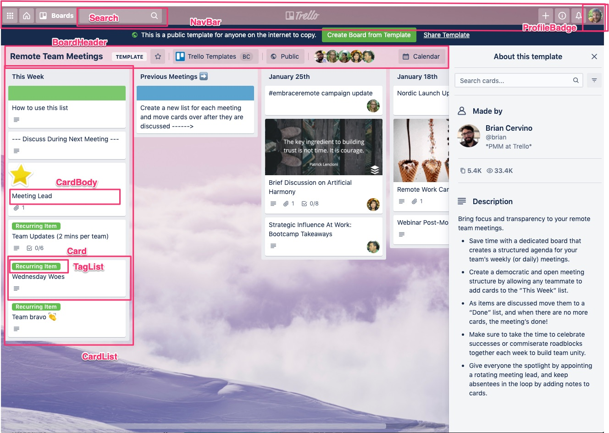

## Turning UI Into Components

### Types of Components

1. Semantic Components (`SearchBar`, `MyApp`, etc.)
1. Reusable Components (`Button`, `Modal`, etc.)
1. Behavioral Components

### Semantic Components

- Focuses on describing large chunks of the UI
- Useful for breaking down a complex app into manageable pieces

### Reusable Components

- More generic
- Props-driven
- Intended for use in many contexts

### Behavioral Components

- Names like 
  - higher order components
  - render props components
- Gives business logic to other React components

### Visualizing Components

### Visualizing Components

### Exercise

1. Take a screenshot of a UI you really like
1. Annotate it with components
  1. Provide an (S) or a (R) with each component name for whether it's Semantic or Reusable
1. If you don't know how to annotate a screenshot, download [Skitch](https://evernote.com/products/skitch)
