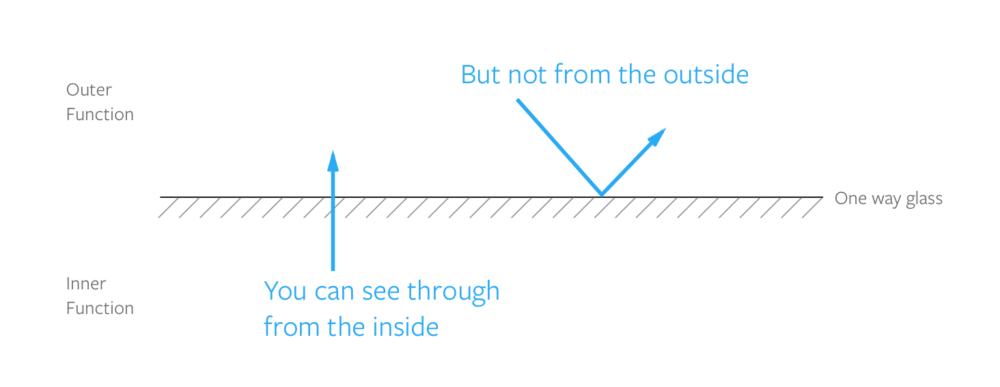

## Variable Scope

### Variable Scope

  - **Scope**: where can we access a variable?

  - Two types of scope: **global** and **local**

  - If you don't use `const`/`let`/`function`/`var`, then variables are **global**
  
  - When you set/get global variables, explicitly use `window`

### Function Scopes

* Functions create **separate** scopes
* Variables defined inside a scope inaccessible from outside

### Function Scopes

~~~ {.javascript insert="../../../src/examples/js/scopes.js" token="function-scopes"}
~~~

### Function Scopes

~~~ {.javascript insert="../../../src/examples/js/scopes.js" token="function-scopes-answer"}
~~~

### Nested Scopes

~~~ {.javascript insert="../../../src/examples/js/scopes.js" token="nested-example"}
~~~

### Nested Scopes

https://css-tricks.com/javascript-scope-closures/

### Lexical Scoping

**Lexical Scoping**: scope is based on position in code. 

Inner scopes include scope of parent scopes.

### Nested Scopes

~~~ {.javascript insert="../../../src/examples/js/scopes.js" token="nested-example"}
~~~

### Nested Scopes

~~~ {.javascript insert="../../../src/examples/js/scopes.js" token="nested-answer"}
~~~

### Shadowing

Variables in inner scopes temporarily override

or **shadow** variables by the same name in outer scopes

### Shadowing

~~~ {.javascript insert="../../../src/examples/js/scopes.js" token="shadowing"}
~~~

### Shadowing

~~~ {.javascript insert="../../../src/examples/js/scopes.js" token="shadowing-answer"}
~~~

### Challenge Exercise

~~~ {.javascript insert="../../../src/examples/js/scopes.js" token="scope-challenge"}
~~~

### Challenge Exercise

~~~ {.javascript insert="../../../src/examples/js/scopes.js" token="scope-challenge-answer"}
~~~

### Challenge Exercise 2

~~~ {.javascript insert="../../../src/examples/js/scopes.js" token="scope-challenge-2"}
~~~

### Challenge Exercise 2

~~~ {.javascript insert="../../../src/examples/js/scopes.js" token="scope-challenge-2-answer"}
~~~

### Block Scope

`const` and `let` variables have **block scoping**.

This basically means any `{ ... }` defines a new scope.

~~~ {.javascript insert="../../../src/examples/js/scopes.js" token="block-scope"}
~~~

### Block Scope

`const` and `let` variables have **block scoping**.

This basically means any `{ ... }` defines a new scope.

~~~ {.javascript insert="../../../src/examples/js/scopes.js" token="block-scope-answer"}
~~~

### Block Scope

You can even use just a plain `{ }` to create a scope namespace.

~~~ {.javascript insert="../../../src/examples/js/scopes.js" token="block-scope-2"}
~~~

### Block Scope

You can even use just a plain `{ }` to create a scope namespace.

~~~ {.javascript insert="../../../src/examples/js/scopes.js" token="block-scope-2-answer"}
~~~

### Top-Down Code

Does this work?

~~~ {.javascript insert="../../../src/examples/js/scopes.js" token="top-down"}
~~~
